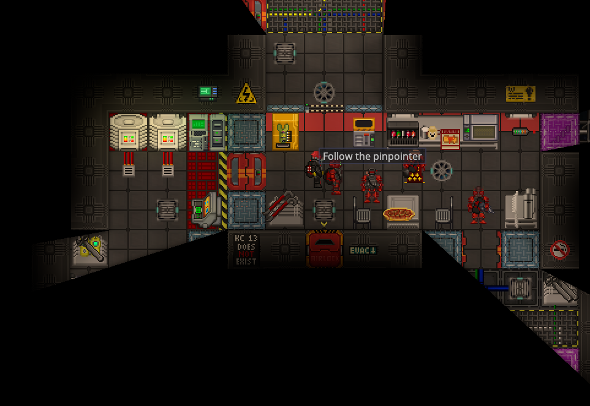
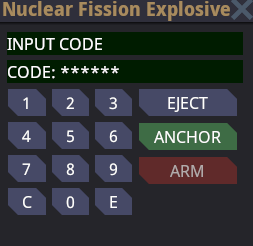

# Operatorzy jądrowi

„Jesteś agentem nuklearnym. Twoim celem jest wysadzenie stacji NT14 Bagel Station LV-408 i upewnienie się, że pozostanie po niej tylko sterta gruzu. Twoi szefowie, Syndykat, dostarczyli ci narzędzia potrzebne do wykonania zadania. Śmierć Nanotrasen!”



Gratulacje, Agencie nuklearny, powierzono ci chwalebne zadanie: zniszczenie stacji Nanotrasen SS14. Jesteś albo elitarnym agentem, agentem medycznym, albo dowódcą najwyższego szczebla. Musisz współpracować ze swoją drużyną, aby za wszelką cenę zniszczyć stację.

## Twoje główne cele

1. Pobierz dysk uwierzytelniający Nuclear Authentication Disk. 
2. Użyj go, aby aktywować ładunek wybuchowy oparty na rozszczepieniu jądrowym. 
3. Ucieknij żywy na swoim statku infiltracyjnym. (Opcjonalnie)

## Kolejność operacji

Dobry plan to taki, który nie jest przygotowywany w pośpiechu. Masz mnóstwo czasu na swojej planecie i na pokładzie statku infiltracyjnego, więc wykorzystaj go, aby odpowiednio się wyposażyć i opracować plan wraz z innymi agentami. Wykorzystaj ten czas również na zapamiętanie kodów uwierzytelniających broni jądrowej, które znajdują się na kartce papieru na mostku statku.

Podstawowy plan wygląda następująco:

1. Zaplanuj atak.
2. Zamów przedmioty, broń i materiały wybuchowe za pomocą Syndicate Uplink, aby zamienić się w chodzącą zbrojownię.
3. Infiltruj stację, korzystając ze swojego statku i wyposażenia.
4. Ukradnij dysk uwierzytelniający broń jądrową.
5. Wybuchaj ładunek wybuchowy rozszczepienia jądrowego.
6. Ewakuuj się najlepiej z powrotem na statek infiltracyjny Syndicate. (Opcjonalnie)

### Pierwsze przedstawienia

Kiedy runda się rozpocznie, znajdziesz się na planecie nukie. Tutaj znajdziesz swoją drużynę, kody nuklearne i cały sprzęt potrzebny do infiltracji stacji. Znajdziesz tu również statek, którym będziesz musiał się dostać do stacji. Zwróć uwagę, kto jest liderem twojej drużyny – będzie on nosił tytuł dowódcy. Aby uniknąć nieporozumień, wszyscy agenci i operatorzy powinni słuchać i wykonywać polecenia dowódcy. Ostatnią rzeczą, jakiej chcesz, jest pięć różnych planów. Jesteście drużyną uderzeniową, a nie samotnymi operatorami, więc zachowujcie się odpowiednio.

<figure><figcaption></figcaption></figure>

### Tworzenie planu

Przede wszystkim nie spiesz się. Nie zostaniesz wykryty, dopóki nie wypowiedziesz wojny w tym momencie. Wykorzystaj ten czas, aby opracować plan wraz ze swoim dowódcą i pomóc w kierowaniu innymi agentami. Przed wydaniem wszystkich telekryształów skonsultuj się z zespołem. Słuchaj dowódcy i współpracuj z nim, aby opracować plan zrozumiały dla wszystkich. Operacje bez planu najczęściej kończą się niepowodzeniem.

### Wyposażenie

Każdy agent powinien zawsze mieć przy sobie elastyczny zestaw wyposażenia. O ile nie jest to częścią planu, nie chcesz być facetem z 15 blokami C4 i bez broni do obrony. Im więcej masz opcji, tym większe masz szanse na wykonanie misji. Zróżnicowany i elastyczny zestaw wyposażenia pozwoli ci dostosować się do większej liczby sytuacji w locie i zwiększy twoje szanse na sukces misji.

Najważniejszym elementem wyposażenia jest lokalizator. To poręczne urządzenie wskazuje główny cel, czyli dysk uwierzytelniający. W miarę zbliżania się do dysku strzałka na lokalizatorze zaczyna się zmieniać. Z czerwonej na niebieską, a następnie na zieloną. Gdy znajdziesz się w odległości jednego pola od dysku, lokalizator zacznie migać czarną kropką.

Będziesz potrzebował środków umożliwiających infiltrację stacji. Domyślnie nie będziesz miał dostępu do zewnętrznych i wewnętrznych śluz powietrznych stacji. Pamiętaj, aby zabrać ze sobą sprzęt umożliwiający dostęp do tych obszarów. Twoją podstawową formą obrony jest szybkość i skradanie się. Jeśli utkniesz za śluzą powietrzną, jesteś praktycznie martwy, jeśli załoga cię odkryje i zaatakuje twoją drużynę.

Pamiętaj, agencie, jesteś przydatny dla swojej drużyny tylko wtedy, gdy żyjesz. Jeśli zginiesz, załoga będzie miała dostęp do twojego sprzętu. Graj mądrze i pozostań przy życiu. Bądź nieuchwytny i nie rzucaj się na tłum członków załogi. Za wszelką cenę dbaj o bezpieczeństwo swoje i, co ważniejsze, swojego sprzętu.

| Wyposażenie                             | Koszt    | Opi                                                                                                                                                                |
| --------------------------------------- | -------- | ------------------------------------------------------------------------------------------------------------------------------------------------------------------ |
| Urządzenie zakłócające uwierzytelnianie | 5 TC     | Najszybszy, najcichszy i najbardziej niezawodny sposób dotarcia do miejsc, do których nie masz wstępu. Wyposażony w 3 ładunki, które uzupełniają się co 90 sekund. |
| Skład C-4                               | 2 TC     | Wolniejszy, bardziej brutalny sposób otwierania śluz powietrznych i ścian stacji. Statek jest wyposażony w kilka takich urządzeń za darmo.                         |
| Broń do walki wręcz                     | N/A      | Jeśli musisz uciekać się do walki wręcz, aby otworzyć śluzę, prawdopodobnie już nie udało ci się wykonać misji.                                                    |
| Łom                                     | Za darmo | Przydatny do otwierania niezasilanych śluz powietrznych.                                                                                                           |
| Szczęki życia                           | 2 TC     | Przydatny do otwierania zasilanych śluz powietrznych oraz niezwykle szybkiego otwierania niezasilanych śluz powietrznych i przeciwpożarowych.                      |

Broń dystansowa będzie Twoim głównym źródłem siły rażenia. Twoja amunicja jest jednak bardzo ograniczona, więc celuj ostrożnie. Strzelanie na oślep w korytarzach lub używanie trybu automatycznego do celów odległych to świetny sposób na zużycie całej amunicji i zamienienie się w chodzącą piñatę, którą załoga może zamordować i ograbić. Pamiętaj, że Twoim głównym celem nie jest zastrzelenie całej załogi. Długotrwałe strzelaniny często prowadzą do wyczerpania amunicji i opanowania Twojej pozycji przez załogę. Zawsze bądź w ruchu i wybieraj cele. Nie marnuj amunicji na klauna grającego na tubie i oszczędzaj ją na ochronę i bardziej bezpośrednie zagrożenia. I, na litość boską, zawsze sprawdzaj linię strzału, nie strzelaj swoim kolegom w plecy!

| Wyposażenie        | Koszt | Opis                                                                                                                                                   |
| ------------------ | ----- | ------------------------------------------------------------------------------------------------------------------------------------------------------ |
| Nadwyżka karabinów | 1 TC  | Karabin powtarzalny. Powolny, o małej mocy, tani karabin. Ostatnia deska ratunku.                                                                      |
| Viper              | 3 TC  | Pojawiasz się z jednym. Tani, skuteczny pistolet. Przydatny, jeśli zostaniesz złapany podczas przeładowywania głównej broni.                           |
| Python             | 4 TC  | Powolny, ale zabójczy rewolwer. Głośny i niebezpieczny.                                                                                                |
| Cobra              | 4 TC  | Pistolet z tłumikiem. Szybki, zabójczy, cichy.                                                                                                         |
| C-20r bundle       | 17 TC | Niezawodny i celny pistolet maszynowy. W zestawie 3 magazynki.                                                                                         |
| Bulldog bundle     | 20 TC | Półautomatyczna strzelba z bębnem. W zestawie 2 bębny 12g i 1 bęben z woreczkami z fasolą.                                                             |
| China-Lake bundle  | 30 TC | Potężny i niebezpieczny granatnik. Doskonały do kontroli tłumu i ostrzału własnych oddziałów. W zestawie znajduje się 9 granatów.                      |
| L6 Saw bundle      | 35 TC | Solidny lekki karabin maszynowy o pojemności 100 nabojów. Doskonały do eliminowania członków załogi podczas ataku. Wyposażony w 2 magazynki pudełkowe. |

Broń biała powinna być używana głównie do wykańczania powalonych członków załogi, żeby oszczędzać amunicję, albo jako ostateczność podczas przeładowywania. Jeśli skończy Ci się amunicja albo zgubisz broń i będziesz musiał polegać na broni białej, prawdopodobnie szybko zginiesz. Mimo to broń biała może być bardzo skuteczna. Wchodź i wychodź z walki, aby odwrócić uwagę załogi, podczas gdy twoja drużyna wykańcza ich z daleka. Możesz też odwrócić uwagę i odciągnąć ochronę od kapitana i reszty twojej drużyny.

| Wyposażenie    | Cena     | Opis                                                                                |
| -------------- | -------- | ----------------------------------------------------------------------------------- |
| Energy Sword   | 8 TC     | Kieszonkowy, ale niebezpieczny miecz energetyczny. Bardzo głośny i bardzo widoczny. |
| Energy Dagger  | 2 TC     | Mniejsza, tańsza i mniej potężna wersja miecza energetycznego.                      |
| Survival Knife | Za darmo | Poręczna broń zapasowa. Twoja ostatnia deska ratunku.                               |

Broń i materiały wybuchowe nie są jedynymi narzędziami potrzebnymi do tej operacji! Nie lekceważ przydatności narzędzi. Niezależnie od tego, czy są to cygara lecznicze, czy buty antypoślizgowe, warto je kupić, jeśli masz do dyspozycji niewielką ilość telekryształów.

| Wyposażenie              | Cena  | Opis                                                                                                                                                 |
| ------------------------ | ----- | ---------------------------------------------------------------------------------------------------------------------------------------------------- |
| Syndicate Minibomb       | 6 TC  | Mały, rzucany ładunek wybuchowy z 5-sekundowym zegarem. Dobry do tworzenia wyrw w kadłubie i do celów szczególnie trudnych do zniszczenia.           |
| No-slip Shoes            | 2 TC  | Chroni przed upokorzeniem przez silnego klauna z bananową skórką.                                                                                    |
| Blood-red Magboots       | 2 TC  | Pozwala na manewrowanie w stanie nieważkości. Przydatne podczas planowania sabotażu generatora grawitacji.                                           |
| Cybersun Juggernaut Suit | 12 TC | Solidny kombinezon bojowy. Znacznie spowalnia ruchy, ale zapewnia ogromną ochronę przed obrażeniami.                                                 |
| Agent ID                 | 3 TC  | Niesamowite urządzenie, pod warunkiem, że zabijesz kogoś, kto jest tego wart. Potrafi kopiować dostępy oraz dowolnie zmieniać nazwiska i stanowiska. |
| Combat medipen           | 4 TC  | Szybki i skuteczny sposób na zatrzymanie krwawienia i wyleczenie wszelkich obrażeń, podczas gdy Agent jest zajęty zabijaniem klauna.                 |

Każdy agent powinien zawsze mieć przy sobie, w kolejności według ważności:

* Wykrywacz do lokalizowania dysku.
* Sprzęt ułatwiający włamanie się do stacji i otwarcie śluz powietrznych.
* Broń dalekiego zasięgu do eliminowania członków załogi stojących na drodze.
* Legitymację agenta, aby zapobiec zabiciu przez sztuczną inteligencję stacji.
* Wystarczającą ilość amunicji do długotrwałych walk.
* Broń białą na wypadek, gdyby skończyła się amunicja lub zgubiłeś broń.
* Narzędzia takie jak lekarstwa lub buty antypoślizgowe.

### Infiltracja

Jest to prawdopodobnie najważniejsza część operacji. Wykonaj ją dobrze, a zyskasz przewagę szybkości i zaskoczenia. Jeśli popełnisz błąd, załoga będzie miała wystarczająco dużo czasu, aby się uzbroić.

Po opracowaniu planu i wyposażeniu wszystkich członków załogi pilot przeleci statkiem infiltracyjnym do stacji. Szybko załóż hełm i elementy wewnętrzne kombinezonu kosmicznego, a następnie przejdź do kadłuba. Korzystając z zaplanowanego planu działania, ty i twój zespół przebijecie się przez kadłub i wejdziecie na pokład stacji. Jeśli wszystko pójdzie dobrze, ty i twój zespół przenikniecie do stacji bez wiedzy załogi, o ile sztuczna inteligencja stacji was nie wykryje.

Istnieje wiele różnych metod infiltracji stacji. Czy wybierzesz głośną akcję i wykorzystasz szybkość oraz siłę ognia, korzystając z dezorientacji załogi? A może zdecydujesz się na bardziej subtelne podejście? Czasami w tym momencie operacji korzystne będzie powolne działanie. Sabotuj stację przed wejściem na pokład. Być może warto wysłać agenta przebranego za członka załogi, aby po cichu wszedł do pomieszczeń technicznych. Każda metoda ma swoje zalety i wady. Pamiętaj, aby zaplanować tę część misji z wyprzedzeniem i komunikować się z zespołem. Pamiętaj jednak, że im więcej czasu spędzisz na stacji, tym większe jest ryzyko, że zostaniesz wykryty i zdemaskowany.

### Sabotaż

Jeśli zdecydujesz się na to, a Twój plan wymaga bardziej delikatnego podejścia, Ty i Twój zespół możecie mieć okazję do cichego sabotowania stacji, zanim załoga zauważy Waszą obecność. Po cichu przebijaj sekcje kadłuba, aby części stacji znalazły się w przestrzeni kosmicznej. Umieść pochłaniacz mocy i odwróć uwagę osób odpowiedzialnych. Przeprowadź ponownie instalację atmosferyczną i pozbaw załogę tlenu do oddychania. Przebierz się za członka załogi i wyłącz podstacje energetyczne lub generator grawitacyjny, aby dobrze wykorzystać swoje buty magnetyczne. Wybór opcji należy do Ciebie.

Dobre sabotaż wymaga czasu i planowania. Omów tę część misji podczas planowania operacji z zespołem. Pamiętaj, że niektórzy członkowie załogi, zwłaszcza inżynierowie, mogą przyjść i zbadać źródło spowodowanych przez ciebie problemów. Im więcej czasu twój zespół poświęci na sabotaż stacji, tym większa szansa na zmyłkę załogi i sukces misji. Z drugiej strony jednak każda sekunda, którą spędzisz, to kolejna sekunda, którą załoga ma na przygotowania. Naukowcy będą poszukiwać lepszych technologii, a dział transportu może zamówić skrzynie z bronią do walki z kosmicznymi karpiami. Pamiętaj, że im więcej sabotażu spowodujesz i im dłużej pozostaniesz niezauważony, tym większe są szanse, że zostaniesz wykryty. Gdy twoja przykrywka zostanie zdemaskowana, a załoga zauważy, że jesteś na stacji, najlepiej będzie przejść do kolejnej fazy operacji.

### Napaść

Pamiętaj, agent, szybkość i dyskrecja to twoje najlepsze narzędzia. Poruszajcie się szybko razem i nie pozwólcie załodze zdradzić waszej dokładnej lokalizacji. Nie wdawajcie się w niepotrzebne strzelaniny z nieuzbrojoną załogą, ponieważ jest to strata cennego czasu i amunicji. Powinniście uważnie obserwować lokalizator i jak najszybciej dotrzeć do dysku. Najlepszym scenariuszem jest zaskoczenie kapitana, gdy jest nieprzygotowany. Jeśli spędzisz zbyt dużo czasu za śluzami powietrznymi lub walcząc z załogą, kapitan będzie miał czas, aby się zabarykadować, a ochrona i załoga zaczną się uzbrajać, zanim dotrą do twojej pozycji. Nie walcz uczciwie, nie daj załodze chwili na podanie twojej pozycji. Skoncentruj się na misji, agencie. Poruszaj się szybko i celnie strzelaj do każdego członka załogi, którego spotkasz. Nie ścigaj niepotrzebnych członków załogi, nie podejmuj walk, których nie możesz wygrać, i zdobądź ten dysk za wszelką cenę.

### Nabycie dysku

W większości przypadków dysk będzie przy Kapitanie, w torbie lub kieszeni. Jeśli nie, prawdopodobnie będzie go miał Szef Ochrony lub inna odpowiednia jednostka. Podążaj za swoim namierzaczem, aż go znajdziesz. Po zdobyciu dysku, Twój pierwszy główny cel zostanie zrealizowany. Wykonaj szybki i zorganizowany odwrót ścieżką infiltracji. Masz już dysk, więc nie musisz już zostawać i walczyć z załogą, ryzykując śmierć i niepowodzenie misji. Szybko wróć trasą ataku i wróć na statek infiltracyjny. Na pokładzie znajduje się ładunek wybuchowy do rozszczepienia jądrowego.

Alternatywnie, jeśli Ty i Twój zespół nie będziecie mogli wrócić na statek, w skarbcu na mostku stacji znajduje się drugi ładunek wybuchowy do rozszczepienia jądrowego. Ta opcja może jednak narazić Twój zespół na większe ryzyko. Jeśli działasz głośno, a załoga już wie o Twojej operacji, lepszym rozwiązaniem może być szybkie dotarcie do skarbca i stacji z ładunkiem atomowym. Z drugiej strony, powrót na statek infiltracyjny może być lepszym rozwiązaniem, jeśli twoja drużyna była wystarczająco szybka i dyskretna. Im więcej czasu spędzisz na stacji, tym mniejszą przewagę będziesz mieć ty i twoja drużyna.

Tak czy inaczej, gdy ty i twoja drużyna zdobędziecie dysk, waszym kolejnym najważniejszym celem będzie dotarcie do urządzenia rozszczepienia jądrowego. O ile nie przeszkadzasz i nie odwracasz uwagi swojej drużyny, NIE wdawaj się w morderczą serię wokół stacji. Angażowanie się w przedłużającą się strzelaninę, marnowanie amunicji i utknięcie w martwym punkcie, mając dysk, to błąd, którego nie chcesz popełnić. Zaatakuj najbliższe urządzenie nuklearne i przejdź do kolejnej fazy operacji.

### Uzbrojenie ładunku wybuchowego rozszczepienia jądrowego

Masz dysk, teraz musisz tylko uzbroić broń.

Włóż dysk do urządzenia i wprowadź kody do bomby atomowej. Jeśli zapomnisz kodów, powinny znajdować się na kartce papieru na mostku statku infiltratora (powinieneś go już zniszczyć i zapisać kod w innym miejscu, aby uniknąć strat Cybersun).

Wprowadź kody, naciskając klawisz E, i uzbrój urządzenie, najlepiej na stacji. Upewnij się, że urządzenie jest przymocowane do podłogi stacji i naciśnij ARM.

Gdy tylko usłyszysz komunikat o uzbrojeniu, Twoim głównym celem jest obrona bomby atomowej. Aby załoga mogła rozbroić bombę, musi podejść do niej i nacisnąć przycisk DISARM. Ma to długi pasek postępu i nigdy nie powinno się zdarzyć, chyba że popełnisz jakiś błąd.

<figure><figcaption>
Urządzenie nuklearne czekające na kody nuklearne
</figcaption></figure>

### Ucieczka

> Cała ta część jest opcjonalna. Brońcie bomby atomowej, poświęcając swoje życie, albo uciekajcie.

Biegnijcie jak szaleni z drużyną z powrotem do statku Syndykatu Infiltratora i uciekajcie jak najdalej od stacji. Macie 30 sekund na dotarcie z pomieszczenia z bombą do Infiltratora. Czas rozbrajania bomby atomowej wynosi 30 sekund, a po jego upływie bomba atomowa nie będzie mogła zostać rozbrojona.

### Wybuchowe zwycięstwo

Gratulacje, Agencie. Udało ci się zniszczyć jednego z najlepszych Nanotrasenów w ogniu nuklearnym. Twój cel został osiągnięty. Ciesz się zwycięstwem i zapamiętaj to uczucie. Ponownie wezwiemy cię i twoje wzorowe umiejętności.
